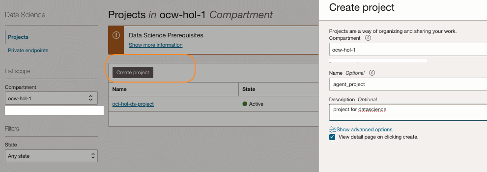
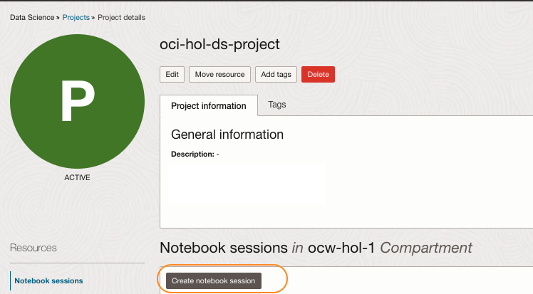
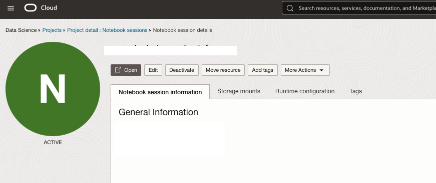
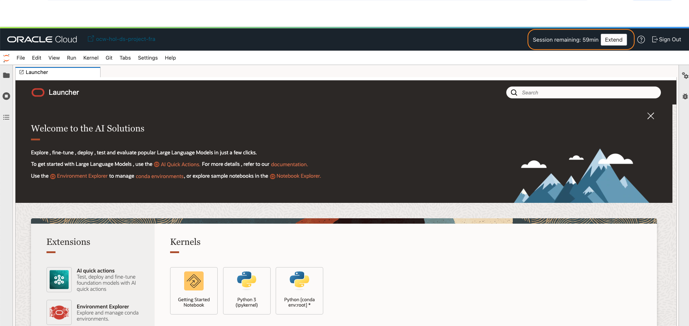
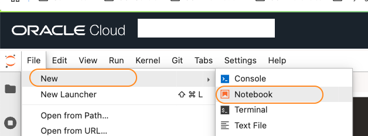
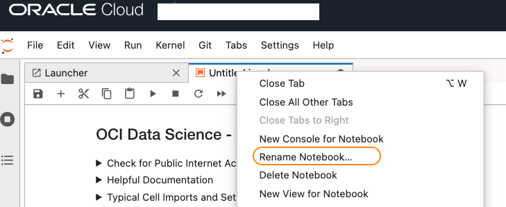
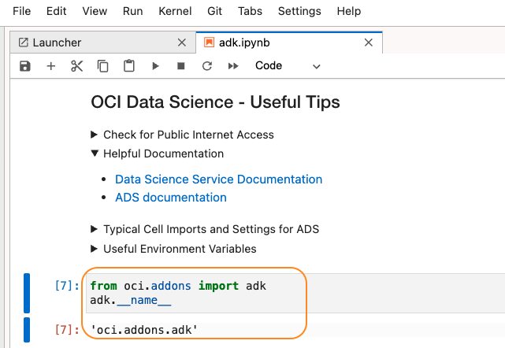

# Setup OCI Agent Development Kit (ADK)

## Introduction

This lab will take you through the steps needed to install ADK using pythonic way.We recomend to use *OCI DATA Science* based notebook to run the operation as it comes with all the necessary software in place,however we have added an optional steps to follow local machine for ADK client setup.

Estimated Time: 30 minutes


## Task 1: Setup OCI Data Science notebook for **ADK** usage.

1. From OCI Console > *AI & Analytics* > *Data science*

    
1. Select *Create project*.Provide name and description.

    

1. With in the project,click *Create notbook session*.

    

1. Provide a name and retain all the other default settings and click *Create*.

    

1. Wait for the resource to become active.

    

1. Open the notbook detail page and click *Open*.

    

1. Provide credentials and multi factor auth when prompted.Wait for the notebook to be opened.

    
    
1. Click *extend* and extend the notbook timeout.

**You can skip the next section and follow to Task 3** 


## Task 2: (Optional) Setup a local machine for **ADK** usage.

1. Python ADK requires Python 3.10 or later. Ensure you have the correct version of Python installed in your environment.
1. Follow below and installed *OCI* with *ADK*

   ```
   <copy>
    # Create a project folder with name of your choice
    mkdir <your-project-name>
    cd <your-project-name>
    # Create and activate a virtual environment under `<myenv>` subfolder
    python -m venv <myenv>
    source <myenv>/bin/activate
   </copy>
   ```
1. After you create a project and a virtual environment, install the latest version of ADK:

   ```
   <copy>
    pip install "oci[adk]"
    pip install oci-cli
   </copy>
   ```
1. Create an *API Signing Key* and store for further usage. Refer [here](https://docs.oracle.com/en-us/iaas/Content/API/Concepts/apisigningkey.htm#two) for detailed steps.

## Task 3: Validate ADK installation using OCI Data science.

1. Follow below steps if you are using a data science notbook.If not move to Task 4.

* Click File > New >Notebook.

    

1. Right click on Untitled notbook and rename the same.

    

1. Run below and validate it retruns the correct name reference.

   ```
   <copy>
    from oci.addons import adk
    adk.__name__
   </copy>
   ```
    

## Task 3: Validate ADK installation for local setup.

1. Follow below steps for local machine

   ```
   <copy>
    from oci.addons import adk
    adk.__name__
   </copy>
   ```
1. Validate the name reference.

**Proceed to the next lab.**

## Acknowledgements

* **Author**
    * **Rahul MR**, Prinicipal Solutions Architect - OCI 
* **Contributors**
    * **Sanjeeva Kalva**, Principal Data Scientist - OCI 
