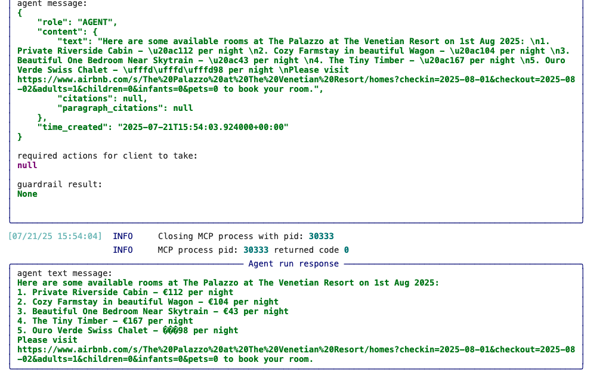

# Configure OCI Agent RAG tool

## Introduction

This lab will take details the steps to configure Agent using the tools that created.It will also provide the steps to add additional client side tools such as Custom tools using function as well as integration with *Model Context Protocol- MCP*.

## Task 1: Import ADK modules.
The tasks imports various ADK python modules as well as some of the optional libaries for our usage.All these instructions works for python script as well as OCI Datascience notebooks.

1. Add below to the notebook cell.

    ```
    <copy>
    import asyncio #For Async run 
    from typing import Any,Dict # Python types 

    from oci.addons.adk import Agent, AgentClient,tool #ADK Agent / tools and clients

    from oci.addons.adk.tool.prebuilt import AgenticRagTool #For RAG tool defenition 

    from oci.addons.adk.mcp import MCPClientStreamableHttp,MCPClientStdio
    from mcp.client.stdio import StdioServerParameters
    from mcp.client.session_group import StreamableHttpParameters
    </copy>
    ```
1. Add below snippet for enabling async run for notbook.

    ```
    <copy>
    import nest_asyncio
    nest_asyncio.apply()
    </copy>
    ```

    
1. For notebook,you may use the *Play* button and run these commands.For python script ,you may use your editor or run using *python scrip.py* format.


## Task 2: Define variables.

1. Define variables for agent endpoint and RAG knowledge based IDs.

    ```
    <copy>
    agent_endpoint="endpoint OCID"
    knowledge_id="knowledgebase OCID"
    </copy>
    ```
1. Define instructions for agents.

    ```
    <copy>
    instructions_agent_core = """
    You are an OCI Agent.
    Use RAG tool to answer vector search and oracle sales and annual reports related answers.
    Use tool check_season for all weather related answers.
    Use mcp_tools for github and repo and room availability related answers.
    """
    </copy>
    ```

    

## Task 3: Define a custom tool based on function.

1. Use below code to set a simple custom function based tool,which will return the season based on a location.

    ```
    <copy>

    #Defenition of our tool and dont forget the @tool
    @tool(description="Get the season for a location")
    def check_season(location:str) -> Dict[str, Any]:
        """Get the season for a given location

        Args:
        location(str): The location for which season her is queried
        """
        data = {
            "India":"Monsoon",
            "USA":"Summer",
            "Europe":"Summer",
            "Brazil":"Winter"

        }
        try:
            return {"location": location, "season": data[location]}
        except Exception as error:
            return {"location": "Unknown", "season": "Unknown"}
        </copy>
    ```

    

## Task 4: Define mcp call using stdIO mode.

* We are using an opensource mcp library to fetch information from public internet.
* The library details and credit goes to https://github.com/openbnb-org/mcp-server-airbnb.
* If you are using local client execution ,enusre nodejs and npx is available for run.

1. Copy the below to notebook or local script to define the MCP.

    ```
    <copy>
    #MCP with Local Libarary Params 
    bnb_mcp_params = StdioServerParameters(
            command="npx",
            args=["-y" ,"@openbnb/mcp-server-airbnb", "--ignore-robots-txt"],
        )

    </copy>
    ```

    


## Task 5: Connect Knowledge base to the RAG too.

1. Connect knowledge base id and RAG tool with the agent.To do so copy below snippet and pase to the notbook or python script.

    ```
    <copy>
    #RAG tool defenitons
    core_rag_tool = AgenticRagTool(
            name="oci_hol_rag_tool",
            description="RAG tool to answer oracle linux,vector search and sql related queries",
            knowledge_base_ids=[knowledge_id],
        )
    </copy>
    ```

    

## Task 6: Define an agent and connect with the tools.

1. Use below snippet to define an agent along with the tools.You need to update the placeholders accordingly.

    ```
    <copy>
    async def agent_handler(prompt:str="",init_run:bool=False,delete_session:bool=True,session_id:str=None):
         async with (
                MCPClientStdio(params=bnb_mcp_params,name="bnb mcp") as bnb_client):
            client = AgentClient(
                  auth_type="resource_principal", #"api_key" for local setup,
                  profile="DEFAULT", #OCI config profile name
                  region="eu-frankfurt-1",  # OCI region such as "us-chicago-1" or airport code such as "ORD"
                  #config="Path to OCI config if its not the default one (~/.oci/config)" #
               )
    
            agent_core = Agent(
                client=client,
                agent_endpoint_id=agent_endpoint,
                instructions=instructions_agent_core,
                tools=[check_season,core_rag_tool,await bnb_client.as_toolkit()]
                
            )
            if init_run:
                agent_core.setup()
            if session_id is not None:
                response = await agent_core.run_async(prompt,delete_session=delete_session,max_steps=5,session_id=session_id)
            else:
                response = await agent_core.run_async(prompt,delete_session=delete_session,max_steps=5)
            return response
    </copy>
    ```
    


## Task 7: Intialize and setup the agent.
During the process the ADK will check the tools defined and associate with the Agent.
The process may take several minutes depends on the tools and their configuration.

1. Run below to setup and run a sample query.A setup process is only needed for the first time or for any configuration changes that needs to push from local or notebook to agents.You may update your query as well.

    ```
    <copy>
    question="give availability of room at The Palazzo at The Venetian Resort on 1st Aug 2025"
    response = asyncio.run(agent_handler(prompt=question,init_run=True)) 
    response.pretty_print()
    </copy>
    ```
    


1. Wait for the execution to complete and validate the result.A result would look like as below.

    


**Proceed to the next lab.**

## Acknowledgements

* **Author**
    * **Rahul MR**, Prinicipal Solutions Architect - OCI 
* **Contributors**
    * **Sanjeeva Kalva**, Principal Data Scientist - OCI 